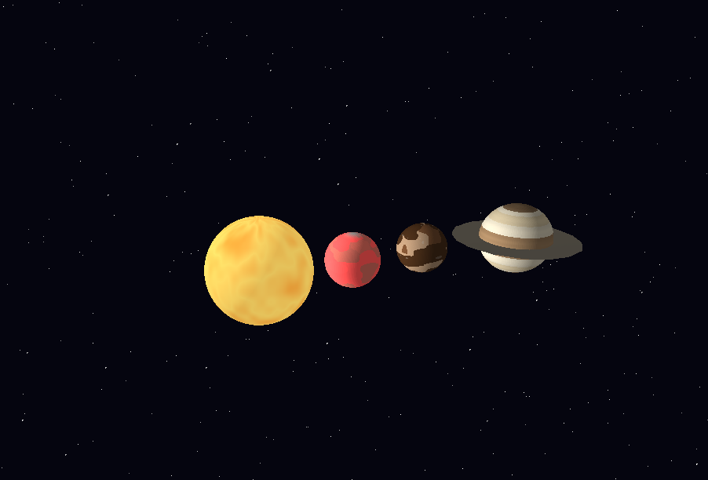
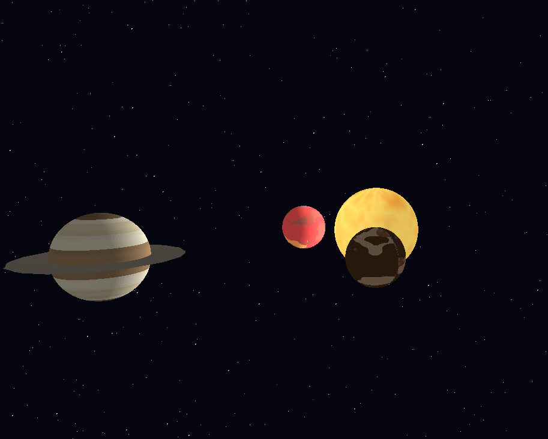

# 🪐 Sistema Solar con Shaders Procedurales

Implementación de un sistema solar estilizado en Rust, con shaders procedurales para cada planeta.  
Incluye **Marte**, **Mocca** (inventado), **Saturno** (con anillos), y el **Sol**.



  

---

## 🛠️ Compilación y ejecución

```bash
git clone https://github.com/tu-usuario/sistema-solar.git
cd GraficasLab4
cargo run
```
---

## 🎮 Controles
Flechas ← → ↑ ↓: rotar cámara alrededor del sistema.

---

## 📚 Documentación técnica

### Estructuras clave
###### Uniforms (src/main.rs)
Define los parámetros globales pasados al pipeline de renderizado:

```rust
pub struct Uniforms {
    pub model_matrix: Matrix,    // Transformación: mundo local → mundo
    pub view_matrix: Matrix,     // Cámara: mundo → vista
    pub projection_matrix: Matrix, // Proyección: vista → clip
    pub viewport_matrix: Matrix, // Viewport: clip → pantalla
    pub is_ring: bool,           // Activa geometría plana para anillos
}
```

###### Fragment (src/fragment.rs)
Datos interpolados por fragmento (píxel):

```rust
pub struct Fragment {
    pub position: Vector3,       // Posición en pantalla (x, y, depth)
    pub world_position: Vector3, // Posición en mundo (para iluminación)
    pub color: Vector3,          // .x = iluminación, .y = u, .z = v (UVs fijas)
    pub depth: f32,              // Profundidad para Z-buffer
}
```

###### Vertex (src/vertex.rs)
Datos por vértice:

```rust
pub struct Vertex {
    pub position: Vector3,       // Posición original (local)
    pub normal: Vector3,         // Normal original
    pub tex_coords: Vector2,     // Coordenadas de textura (no usadas, reemplazadas por UVs esféricas)
    pub color: Vector3,          // .x=iluminación bruta, .y=u, .z=v (UVs fijas)
    pub transformed_position: Vector3, // Posición post-transformación
    pub transformed_normal: Vector3,   // Normal post-transformación
    pub world_position: Vector3,       // Posición en mundo
}
```